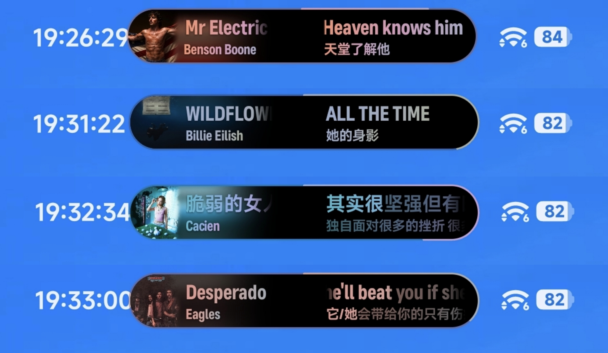
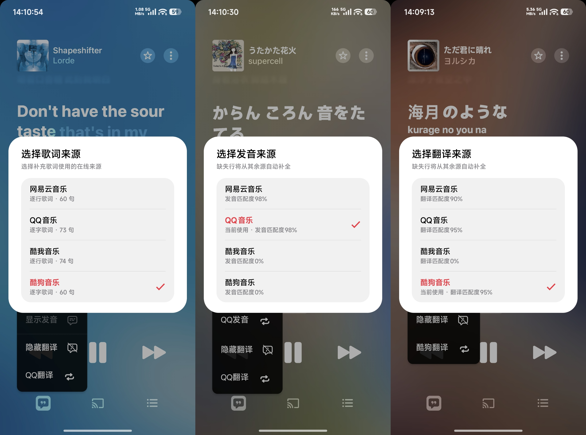
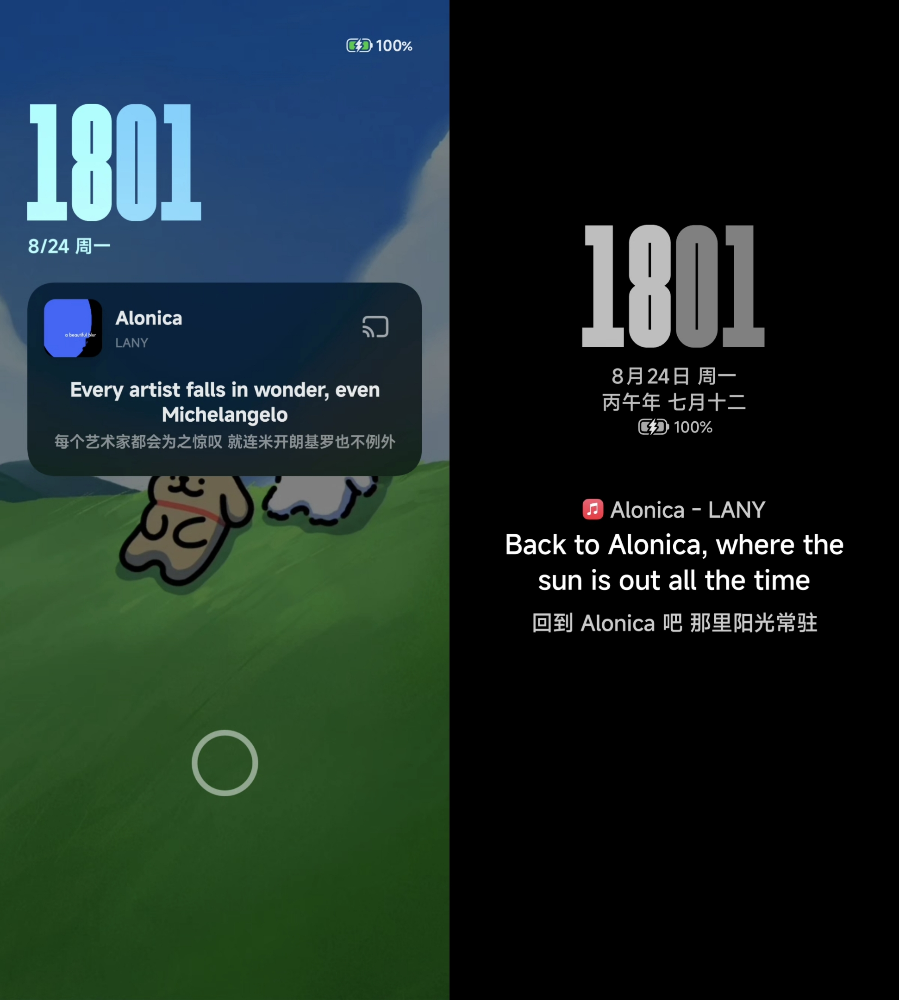
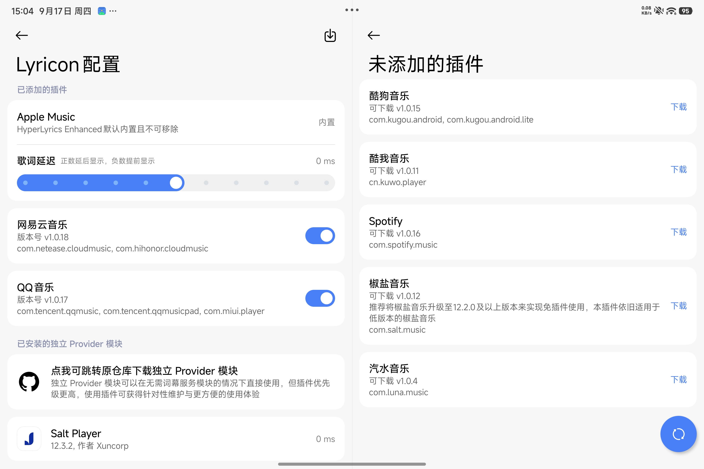

<p align="center">
  <a href="README.md">简体中文</a> · <strong>English</strong>
</p>

<p align="center">
  
</p>

<h1 align="center">HyperLyrics Enhanced</h1>

<p align="center">
  <strong>Lyrics, wherever your music takes you.</strong><br />
  Apple Music enhancements · HyperOS HyperIsland · Media cards · AOD lyrics
</p>

<p align="center">
  
  
  <a href="#compatibility"></a>
  <a href="LICENSE"></a>
</p>

<p align="center">
  <a href="https://github.com/juren233/HyperLyrics-Enhanced/releases"><strong>Download & updates</strong></a> ·
  <a href="#preview">Screenshots</a> ·
  <a href="#quick-start">Quick start</a> ·
  <a href="#compatibility">Compatibility</a> ·
  <a href="https://github.com/juren233/HyperLyrics-Enhanced/issues">Report an issue</a>
</p>

---

HyperLyrics Enhanced is an **LSPosed module for lyrics in HyperIsland and on the always-on display (AOD)** on **Xiaomi HyperOS devices**. It also offers **Apple Music enhancements for Android devices beyond Xiaomi**. Lyricon Central, the lyrics service, and the Apple Music Provider are built in; plugins connect other music apps. Devices without LSPosed can use notification-based lyrics instead.

This project is based on [limczhh/HyperLyric](https://github.com/limczhh/HyperLyric) and is maintained independently.

> [!IMPORTANT]
> HyperLyrics Enhanced is not an official successor to HyperLyric. Please report issues specific to HyperLyrics Enhanced in **this repository**.

<a id="preview"></a>
## Screenshots

<p align="center">
  <a href="assets/screenshots/渐变封面样式超级岛.jpg"></a>
  <a href="assets/screenshots/AM歌词发音翻译弹窗.jpg"></a>
</p>
<p align="center">
  <sub><strong>HyperIsland</strong> · Gradient covers · Cover-derived gradient colors</sub><br />
  <sub><strong>Apple Music</strong> · Switch lyrics, pronunciation and translation sources</sub>
</p>

<p align="center">
  <a href="assets/screenshots/两种AOD示例.jpg"></a>
  <a href="assets/screenshots/平行窗口与Lyricon插件.jpg"></a>
</p>
<p align="center">
  <sub><strong>AOD lyrics</strong> · Left: lock-screen AOD · Right: classic AOD</sub><br />
  <sub><strong>Parallel windows & plugins</strong> · Two-pane layout · Lyricon plugin management</sub>
</p>

Click any image to view the original.

<sub>Screenshots show the Chinese interface on different devices and configurations. Appearance may vary with the app version, system and personal settings.</sub>

<a id="features"></a>
## Features

### What does Enhanced add?

Building on HyperLyric's system-level lyric display, Enhanced focuses on **fewer separate modules, deeper Apple Music integration, and expanded lyric sources and AOD experiences**.

| Area | Upstream functionality / setup | What Enhanced adds or extends |
| :--- | :--- | :--- |
| **Fewer separate modules** | The Lyricon source requires Lyricon Central and a Lyricon Provider for the music app | **Built-in Lyricon Central and Apple Music Provider**; add, update, enable, disable and repair project-maintained plugins for other music apps within the app, without installing a separate APK module for each one |
| **Enhancements inside Apple Music** | Lyrics are passed to the system UI through lyric providers | **Supplement lyrics, translations and pronunciation, and switch sources inside Apple Music**, alongside font, blur, regional metadata and playback adjustments |
| **Multiple lyric and translation sources** | Online lyric retrieval from NetEase Cloud Music and QQ Music, plus translations supplied by lyric sources | **Four sources: NetEase, QQ Music, Kugou and Kuwo**, with source ordering, per-app controls and automatic best-match selection; Apple Music's native content takes priority by default, with missing content supplemented |
| **AOD lyrics** | No dedicated AOD lyric feature | **Separate lock-screen AOD and classic AOD lyric modes**, with controls for main vocals, backing vocals, translations, the next line, duet layouts and pause behavior |
| **An interface tailored to the device and your needs** | A single configuration approach for feature controls and device support | **A two-pane parallel-window UI** for wide screens, plus **feature entry controls** for HyperIsland, AOD lyrics, notification lyrics and Apple Music enhancements, so you can keep only the sections you need |

> **Please note:** This comparison describes the project's focus, not a comprehensive review or a ranking of the upstream project. Both projects continue to evolve, and differences may change between versions. Availability depends on the device, system and music app version; refer to each project's release notes and actual behavior on your device.

### Apple Music — more than a lyric provider

- **Built-in lyric integration:** Sync word-by-word lyrics, backing vocals, playback state and track information without a separate Apple Music Provider module.
- **Supplement lyrics, translations and pronunciation:** Search online sources for tracks without lyrics, switch sources from the player and inspect match results. Native Apple content is retained by default, with missing content supplemented through third-party online sources and AI as configured.
- **Word-by-word lyric enhancement:** Use the **LunaBeat TTML lyric library** to supply word-timed lyrics for some tracks that only have line-timed lyrics. This is experimental and depends on library coverage and matching.
- **Text and appearance:** Convert Traditional Chinese lyrics to Simplified Chinese, hide pinyin for Mandarin songs, adjust lyric blur and follow the system font. Some font-weight behavior is adapted specifically for HyperOS.
- **Metadata and playback:** Change the region used for content UI language, localize track information, restore original regional names for Chinese, Japanese and Korean tracks, cache metadata lookups, open the full player directly from media notifications, and dynamically boost Dolby Atmos speaker volume.

> Region and language adjustments only affect presentation. They do not unlock songs or services unavailable in your account's region. Apple Music enhancements are not limited to Xiaomi devices, but still require LSPosed and a compatible Apple Music version.

### From HyperIsland to the always-on display

| Where lyrics appear | Available controls |
| :--- | :--- |
| **HyperIsland** | Word-by-word lyrics, backing vocals, duets, translations and pronunciation; dynamic width and width limits, fixed duet width and width-limit removal; cover art, colors and audio-reactive effects |
| **Media cards** | Separate settings for notification-center cards and the expanded HyperIsland card, including cover backgrounds, blur, soft lighting and animated flowing colors |
| **Lock-screen AOD / classic AOD** | Main lyrics, backing vocals, translations, the next line, duet layouts, pause behavior and positioning; classic AOD can show track information using a Focus notification or embedded text |
| **Notification-based Dynamic Island** | A non-root lyric display option with notification styles, icons, a progress bar, track information, tap actions and an app allowlist |

Available styles and controls depend on the system, device and data supplied by the player. Notification-based Dynamic Island mode does not add native HyperOS HyperIsland to other devices.

### More music apps, more lyric sources

- **Lyricon is built in:** No separate Central lyrics-service module is required. Add, update, enable, disable and repair project-maintained Provider plugins in the app, or continue using compatible standalone Lyricon Provider modules.
- **Broad plugin coverage:** NetEase Cloud Music, QQ Music (including HD), Xiaomi Music, Kugou Music (including its Concept edition), Kuwo Music, Spotify, Salt Player and Qishui Music. The in-app catalog determines which plugins are currently available; data capabilities vary by player.
- **Online lyrics and translations:** NetEase Cloud Music, QQ Music, Kugou Music and Kuwo Music, with source toggles, ordering, per-app configuration and automatic selection of better matches.
- **Optional AI translation:** Supplement translations through a user-configured OpenAI-compatible API, or explicitly enable forced AI translation to replace existing translations. You supply the endpoint, model and API key.
- **Other integrations:** [SuperLyric](https://github.com/HChenX/SuperLyric) and [LyricInfo](https://github.com/limczhh/LyricInfo) remain available as alternatives; install and configure their modules according to their own instructions.

### Configure it for your device and habits

**Feature switches** control the entries for HyperIsland, AOD lyrics, notification-based Dynamic Island and Apple Music enhancements. Wide-screen devices can enable the **parallel-window UI**. Other settings include themes and colors, hiding the launcher icon, an entry in system Settings, configuration backup and restore, and log viewing and export.

<a id="quick-start"></a>
## Quick start

Download an APK from [Releases](https://github.com/juren233/HyperLyrics-Enhanced/releases). Prefer a stable release for everyday use. Beta and Canary builds are prereleases; read their release notes before installing.

### 1 · Choose your mode

| What you want | Mode | Requirements |
| :--- | :--- | :--- |
| Lyrics in HyperOS HyperIsland, media cards or AOD | **LSPosed mode** | LSPosed v2.0+, the required scopes and a compatible system implementation |
| Apple Music enhancements without Xiaomi-specific system features | **LSPosed mode** | LSPosed and a compatible Apple Music version; Xiaomi-specific entries can be disabled |
| Notification lyrics without root / LSPosed | **Notification mode** | Notification permission, notification access and usable player data |

The two display paths can be configured separately. Notification mode does not provide Apple Music hooks or Provider plugin injection.

### 2 · Set up LSPosed mode

1. Install the app, enable HyperLyrics Enhanced in **LSPosed**, and select the apps and system components required by your chosen features in its **scope**.
2. Select a source in **Lyric settings**. **Lyricon** is recommended for Apple Music and supported music apps.
3. Configure player integration:
   - **Apple Music:** Ready to use without additional plugins or modules.
   - **Other players:** Open **Lyricon configuration**, add and enable the relevant plugin, then check its scope as instructed.
4. Enable **Xiaomi HyperIsland lyrics**, **Xiaomi AOD lyrics** or **Apple Music enhancements** as needed, then adjust their individual settings.
5. Restart the system UI and the relevant music apps when prompted so the module and plugins can take effect.

<details>
<summary><strong>Common LSPosed scopes</strong></summary>

Select only the components and players you need. Follow the module's recommended scope and the instructions shown in the app.

| Feature / player | Package name |
| :--- | :--- |
| HyperOS system UI and its plugin | `com.android.systemui`, `miui.systemui.plugin` |
| Apple Music | `com.apple.android.music` |
| NetEase Cloud Music | `com.netease.cloudmusic`, `com.hihonor.cloudmusic` |
| QQ Music, QQ Music HD and Xiaomi Music | `com.tencent.qqmusic`, `com.tencent.qqmusicpad`, `com.miui.player` |
| Kugou Music and Concept edition | `com.kugou.android`, `com.kugou.android.lite` |
| Kuwo Music | `cn.kuwo.player` |
| Spotify | `com.spotify.music` |
| Salt Player | `com.salt.music` |
| App entry in system Settings (optional) | `com.android.settings` |

**Qishui Music is an exception:** Its project-maintained plugin uses the system media path, so the Qishui Music app does not need to be selected in the LSPosed scope. The required system-side module environment must still be configured. It does not provide next-track previews.

If you only use Apple Music enhancements, you do not need to select system components for Xiaomi-specific features. The Settings scope is only needed for the entry in system Settings.

</details>

### 3 · Set up notification mode

1. Open **Notification-based Dynamic Island lyrics** and grant both notification permission and notification access.
2. Add your music app to the lyric allowlist and select a suitable lyric source.
3. Choose a notification style supported by your system, then configure the icon, progress bar, track information and tap behavior.
4. If background restrictions interfere, follow the app's guidance for autostart and battery optimization. To bypass Focus notification restrictions using Shizuku, first start Shizuku and grant access.

> [!TIP]
> Missing a feature entry? Check **App settings → Feature switches**. Xiaomi-specific entries are initially enabled or disabled based on the device brand, while the Apple Music entry also depends on whether Apple Music is installed. Manually enabling an entry does not make an unsupported system feature available.

<a id="compatibility"></a>
## Compatibility and limitations

**Installation baseline: Android 13 (API 33) or later, `arm64-v8a` (64-bit ARM).** System enhancements have additional requirements.

| Feature | Environment and limitations |
| :--- | :--- |
| HyperIsland and media-card enhancements | Targets HyperOS 3 / 4 with LSPosed v2.0+; depends on the specific SystemUI and system plugin implementations |
| Apple Music enhancements | Android 13+ with LSPosed; the code includes adaptation profiles for **Apple Music 6.5.0–6.5.3**, not a guarantee of compatibility with arbitrary versions |
| Project-maintained Provider plugins | Requires the relevant app, plugin and scope; consult the plugin catalog and release notes for versions and capabilities |
| Lock-screen AOD / classic AOD | Xiaomi-family devices with a compatible AOD implementation; presentation varies by system |
| Notification lyrics | Android 13+; depends on permissions, player output and background operation |
| Focus notifications / Android Live Updates | Actual presentation is controlled by the system; Android Live Updates require Android 16+ and manufacturer support |
| Media-card pull-down floating-window allowlist bypass | Targets the corresponding Android 16 / HyperOS 3.0.300+ implementation; compatibility must be reassessed after system updates |

- **A system version alone is not a compatibility guarantee.** SystemUI plugins, ROM variants and music app updates can change internal behavior. Avoid enabling overlapping enhancements in multiple modules.
- **Online matches can be incomplete or misaligned.** Tracks with the same title, live recordings, remasters, covers and different edits may use different timelines. Try another source and include the specific track when reporting a problem.
- **Network and data usage depend on the features you use.** Plugin downloads, update checks, online lyrics and translations require network access. AI translation sends the text to your configured service; review its data policies and costs, and never publish your API key.
- **Regional and account restrictions are not bypassed.** Changing Apple Music's content UI region does not alter subscription rights or catalog access.

<a id="faq"></a>
## Frequently asked questions

<details>
<summary><strong>Do I still need Lyricon Central or a separate Apple Music Provider module?</strong></summary>

No. Their corresponding capabilities are built in. For other music apps, start with the project-maintained plugins in **Lyricon configuration**. Apps not covered by the catalog may still work with compatible standalone Lyricon Provider modules, without a separate Central module. SuperLyric and LyricInfo require their own external modules when selected.

</details>

<details>
<summary><strong>I installed a plugin. Why are there still no lyrics?</strong></summary>

Check that the module and plugin are enabled, the scope is correct, the right lyric source is selected, and SystemUI and the music app have been restarted as instructed. Also check whether the track has usable lyrics and whether the player version is supported. In notification mode, check permissions, the allowlist and background restrictions as well.

</details>

<details>
<summary><strong>Can I use this on a non-Xiaomi or non-rooted device?</strong></summary>

Use the features supported by your environment: non-Xiaomi devices can use Apple Music enhancements with a compatible LSPosed setup; devices without root / LSPosed can try notification lyrics. HyperOS HyperIsland and AOD lyrics are not supported on other systems.

</details>

<details>
<summary><strong>Does disabling a feature entry only hide its page?</strong></summary>

No. The entry switch also disables the features it controls, saves their previous toggle state, and restores that state when the entry is enabled again. To adjust appearance rather than disable a feature, use the individual options on its settings page.

</details>

### Reporting an issue

Check [existing issues](https://github.com/juren233/HyperLyrics-Enhanced/issues) before opening a reproducible report. Please include:

- **Environment:** Device model, Android / HyperOS version and LSPosed version.
- **Versions:** HyperLyrics Enhanced version and build number, music app version and Provider plugin version, if applicable.
- **Configuration:** Mode, lyric source, relevant switches and LSPosed scopes.
- **Reproduction:** Track information, steps, expected result, actual result and when the problem occurred.
- **Logs:** Export complete debug logs from app settings after reproducing the issue. Include screenshots or a recording if helpful. Remove credentials, account details and other sensitive information before uploading.

<a id="development"></a>
## Development and building

<details>
<summary><strong>Environment, verification commands and signing</strong></summary>

The project uses Kotlin / Jetpack Compose, Miuix and the Gradle Wrapper. The current configuration uses **compileSdk / targetSdk 37**, and CI uses **JDK 21**. Install the corresponding Android SDK and configure its location.

Run local unit tests without generating an APK:

```bash
bash ./gradlew --no-daemon --max-workers=2 :app:testDebugUnitTest
```

Choose either build command below. Before each packaging attempt, increment `versionCode` in `app/build.gradle.kts` by exactly 1, including retries after a failed build. Tests alone do not require an increment.

```bash
# Debug APK
bash ./gradlew --no-daemon --max-workers=2 :app:assembleDebug

# Or: Release APK
bash ./gradlew --no-daemon --max-workers=2 :app:assembleRelease
```

Configure signing through `keystore.properties` in the project root or the following environment variables. Environment variables take precedence.

| `keystore.properties` key | Environment variable |
| :--- | :--- |
| `storeFile` | `RELEASE_STORE_FILE` |
| `storePassword` | `RELEASE_STORE_PASSWORD` |
| `keyAlias` | `RELEASE_KEY_ALIAS` |
| `keyPassword` | `RELEASE_KEY_PASSWORD` |

When all signing settings are provided, both Debug and Release use that key. A diagnostic Debug APK intended to replace an installed official release must use the same project signing key, not the default debug keystore. A local build without the matching key cannot directly update the official package.

Artifacts are written to `app/build/outputs/apk/`, with the version name and `versionCode` in the filename. Verify the build number in the package metadata. Do not commit signing files, passwords or API keys.

</details>

## Credits and license

This project is released under the [GNU General Public License v3.0](LICENSE). Copyright, licenses and attribution for upstream code and third-party implementations remain with their respective owners; this fork does not change that ownership.

Thanks to these projects and their contributors:

- [HyperLyric](https://github.com/limczhh/HyperLyric) — The upstream foundation of this project.
- [Miuix](https://github.com/compose-miuix-ui/miuix) — HyperOS-style Compose components.
- [Lyricon](https://github.com/tomakino/lyricon) — Lyric subscriptions, data models and the foundation for some lyric animations.
- [SuperLyric](https://github.com/HChenX/SuperLyric) · [LyricInfo](https://github.com/limczhh/LyricInfo) — Optional lyric integrations.
- [libxposed](https://github.com/libxposed/api) — The Xposed API.

---

<p align="center">
  <a href="https://github.com/juren233/HyperLyrics-Enhanced/releases">Download & updates</a> ·
  <a href="https://github.com/juren233/HyperLyrics-Enhanced/issues">Report an issue</a> ·
  <a href="#preview">Back to Screenshots</a>
</p>
